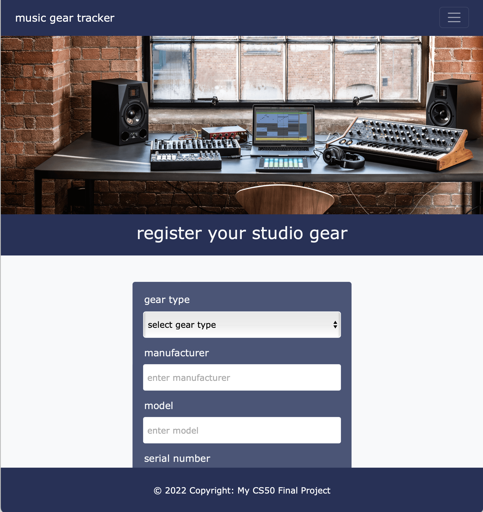
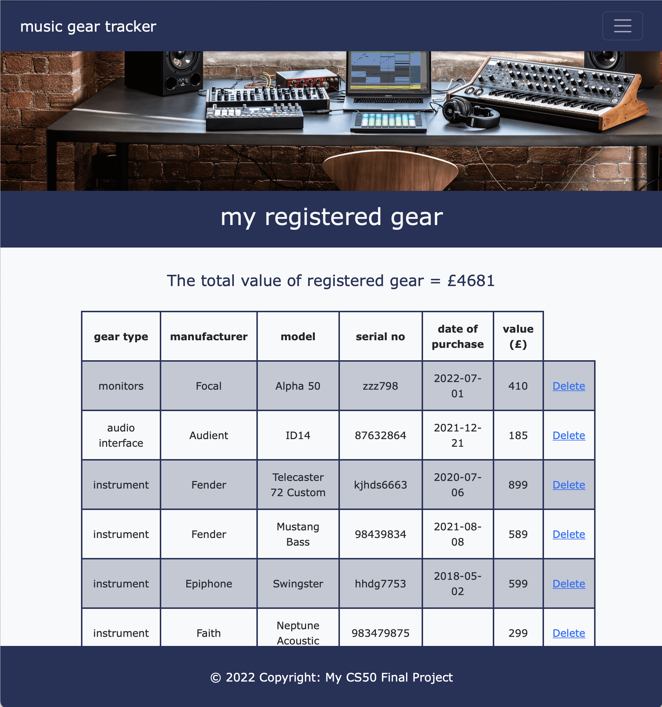

# MUSIC GEAR TRACKER
#### Video Demo:  https://youtu.be/t83br9CMWms
#### View Hosted Demo: http://mikeywilsonuk.pythonanywhere.com
#### Description: A web app to register your home recording studio gear for insurance purposes.

<br>

## About The Project

This is my final project for the CS50 course. For this project I knew I wanted to build a web app with both front and back end functionality. I also knew I was going to be spending many hours inputting data to get things working, so I decided to base it on a subject I enjoy - home studio recording!

The 3 key objectives for my project when starting out were:
* Create a front end form which synched to a database
* Create a front end process to delete stored data from the database
* Query the database to display data on the front end

<br>

### Built With

I used the Flask framework to build my web app, utilising:
* SQLite
* Python
* HTML
* CSS
* JavaScript
* Bootstrap

<br>

## Getting Started

To get a local copy up and running follow these simple example steps:

<br>

### Prerequisites

See the requirements.txt file for details.

<br>

### Installation

Clone the repo 
   ```sh
   git clone https://github.com/mikeywilsonuk/studio-gear-tracker.git
   ```

<br>

## Usage

The app launches on the 'register gear' page displaying a form for users to register music gear. In the header you can navigate to the 'my gear' page which lists all of your registered gear in a table, along with a total £ value for all registered gear and the ability to delete an item of registered gear. There is also an 'about' page for the app.

These screenshots show the 'register gear' and 'my gear' pages:



<br>

## Project Files

This section breaks down all the files I created for the project, including any challenges and solution considerations I faced on the journey.

<br>

### app.py

I used the Flask framework for the app. This is the main Python file which includes all of the code to get the app up and running as well as the main functions of the app.

I started out with very little knowledge on Flask so had to read a lot of documentation to get the basic config in place for the app.

My biggest challenge by far was writing the SQL code to take the user input data from the form and save it into a SQLite database table. I tried various methods with seemingly little progress towards this goal before coming across the SQLAlchemy database toolkit for Python. After some further research and a lot of reading through documentation I was able to save the input data into a SQLite table. 

However, this introduced a new challenge when I started working on a function to query the database to display registered data in a front end table. I already had some basic knowledge of SQL query syntax before starting this project, but SQLAlchemy uses very different syntax and I spent a lot of time trying to get this to work.

Initially I was using the GET HTTP method for collecting data but changed to the POST method so that the data was not visible in the URL.

Implementing the function to delete a row from the database was also a challenge, especially using SQLAlchemy for the first time.

The final function that I built for the app was to query the database and return the sum of the int value column. I was able to query the data within SQLite easily, but again it took some time to get it working with SQLAlchemy.

<br>

### layout.html

I initially created the index.html page, but once I knew I was going to create more html pages I decided to create a template html file using JINJA. On this page I included a Bootstrap header navbar and footer which I later custom styled, and a header image.

The Bootstrap navbar uses pre-built JavaScript on the collapsable toggle.

<br>

### index.html

This is the 'register gear' page and includes a form for the user to register gear, using the POST HTTP method.

I used the Flask flashing system to flash up a message when gear has been successfully / unsuccessfully added.

<br>

### gear.html

This is the 'my gear' page which includes a table displaying all registered gear.

I used the Flash flashing system to loop through the database entries and display them in the table.

I also used the Flask flashing system to flash up a message when gear has been successfully / unsuccessfully deleted.

The final part of my app build was to implement a total value count which sums the value column in the database and displays it as a variable on the page using the Flask flashing system.

<br>

### about.html

This is just a simple static page.

<br>

### styles.css

I used css to style the html pages and also customise the Bootstrap navbar and footer.

<br>

### data.db

I used SQLite for the database. All the code for creating the new database, the table, and all columns is included in the app.py file. I created a separate ID column for the unique identifier which I chose not to display on the front end.

<br>

## Summary

This was my first full stack app project and huge learning curve my me. Thanks for reading!